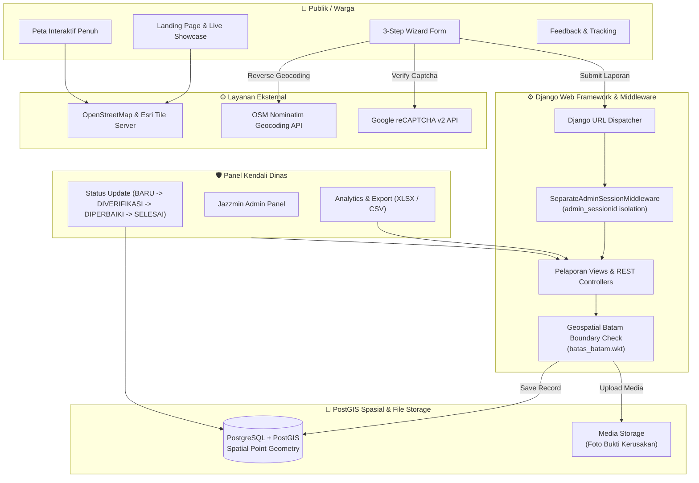
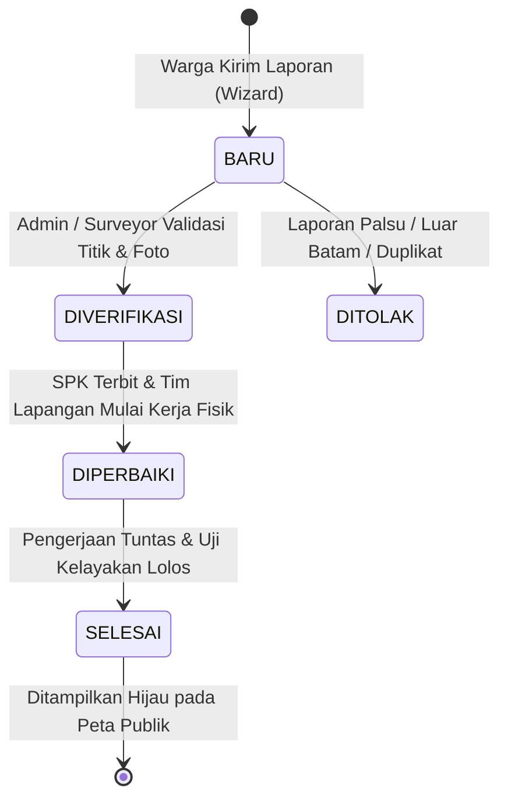

# 🗺️ LaporJalan Batam — Enterprise Civic WebGIS Platform

<div align="center">

[](https://www.djangoproject.com/)
[](https://docs.djangoproject.com/en/5.0/ref/contrib/gis/)
[](https://www.python.org/)
[](https://www.postgresql.org/)
[](https://postgis.net/)
[](https://leafletjs.com/)
[](https://getbootstrap.com/)
[](https://django-jazzmin.readthedocs.io/)
[](LICENSE)

<br/>

### 🏙️ *Sistem Informasi Geografis & Portal Pengaduan Terpadu Kerusakan Infrastruktur Jalan Kota Batam*

<p align="center">
  Platform partisipasi publik berbasis <b>Spatial WebGIS</b> yang menghubungkan masyarakat, surveyor lapangan, dan dinas teknis pemerintah secara transparan, akurat, dan terverifikasi secara geospasial real-time.
</p>

[✨ Fitur Utama](#-fitur-utama) •
[🏗️ Arsitektur](#-arsitektur-sistem) •
[🛠️ Tech Stack](#-tumpukan-teknologi) •
[🚀 Panduan Instalasi](#-panduan-instalasi--setup-lokal) •
[🧩 Setup GDAL Windows](#-konfigurasi-geodjango--gdal-khusus-windows) •
[📡 API GeoJSON](#-dokumentasi-api-endpoint) •
[📂 Struktur Direktori](#-struktur-direktori)

---

</div>

## 📌 Gambaran Umum (Overview)

**LaporJalan Batam** dirancang untuk mentransformasi pelaporan konvensional kerusakan jalan (seperti lubang berbahaya, jalan bergelombang, amblas, dan retak buaya) menjadi alur kerja cerdas berbasis lokasi geospasial. 

Sistem ini memastikan validitas laporan melalui **3-Step Wizard** terpandu dengan integrasi koordinat GPS langsung di peramban, *Reverse Geocoding* otomatis melalui OpenStreetMap Nominatim, validasi batas wilayah poligon spasial Kota Batam (`batas_batam.wkt`), dan isolasi sesi administrasi dinas yang aman tanpa saling mengganggu dengan sesi publik.

---

## ✨ Fitur Utama

### 1. 🌐 Peta Spasial Interaktif Batam (Spatial WebGIS)
- **Glowing Halo Pulse Marker:** Penanda lokasi berbasis SVG dan CSS kustom dengan gelombang animasi bersinar (*pulsing aura*):
  - 🔴 **Merah (`BARU` / `DIVERIFIKASI`):** Laporan terverifikasi menunggu alokasi jadwal pengerjaan.
  - 🟠 **Oranye (`DIPERBAIKI`):** Tim teknis dinas sedang melakukan perbaikan di lapangan.
  - 🟢 **Hijau (`SELESAI`):** Fisik jalan tuntas diperbaiki dan lolos pengecekan akhir.
- **Layer Switcher Tanpa API Key:** Tersedia 4 pilihan peta dasar gratis beresolusi tinggi tanpa watermark (*no API key needed*):
  - 🗺️ *OpenStreetMap Standard*
  - 🏔️ *Esri World Topographic*
  - 🛣️ *Esri World Street Map*
  - 🛰️ *Esri World Imagery (Citra Satelit)*
- **Floating Legend & Quick Action Pill:** Kontrol legenda status melayang di sudut kiri bawah peta dan tombol aksi cepat menuju ruang kerja peta penuh (*fullscreen canvas*).
- **Clustering Marker Cerdas:** Pengelompokan titik terdekat secara dinamis dengan `Leaflet.markercluster` untuk kenyamanan visual saat zoom level rendah.
- **Modal Preview & Galeri Foto:** Klik pada marker membuka modal informatif lengkap dengan status, tanggal lapor, alamat hasil geocoding, dan galeri foto kondisi riil.

### 2. 📝 3-Step Guided Reporting Wizard
Masyarakat dipandu melalui alur 3 langkah intuitif untuk mencegah data tidak lengkap atau koordinat palsu:
- **Langkah 1 — Titik Lokasi Peta & Deteksi Otomatis:**
  - Ambil lokasi akurat via tombol *Gunakan Lokasi Saya* (GPS Browser API).
  - Atau geser pin langsung pada peta interaktif.
  - Alamat jalan dan kecamatan terisi otomatis via *Nominatim Reverse Geocoding*.
  - Salin koordinat instan dengan satu klik.
- **Langkah 2 — Rincian Kerusakan & Quick Tag Chips:**
  - Pemilihan jenis kerusakan (Jalan Berlubang, Retak Buaya, Amblas, dll).
  - Tingkat keparahan (Ringan, Sedang, Darurat/Tinggi).
  - Tombol tag cepat sekali klik untuk melengkapi deskripsi secara instan.
- **Langkah 3 — Bukti Foto, Validasi & Ringkasan:**
  - Unggah hingga 5 berkas foto kondisi lapangan dengan pratinjau thumbnail instan.
  - Kartu ringkasan terstruktur (*live preview*) sebelum pengiriman akhir.
  - Integrasi proteksi spam robotik via **Google reCAPTCHA v2**.

### 3. 🛡️ Dashboard Admin Modern & Analisis Data
- **Tema Enterprise Jazzmin:** Antarmuka panel admin `/admin/` modern, rapi, responsif, dan mendukung mode gelap/terang.
- **Isolasi Sesi Admin (`SeparateAdminSessionMiddleware`):** Menggunakan nama cookie sesi khusus (`admin_sessionid`). Surveyor/Admin dapat membuka panel dinas di tab yang sama tanpa memutus atau menimpa sesi warga di halaman publik.
- **Visualisasi Statistik Real-time (`/admin-stats/`):**
  - Ringkasan metrik total pengaduan, tingkat penyelesaian, dan kasus prioritas.
  - Grafik batang & donat distribusi jenis kerusakan via Chart.js.
  - Daftar pelapor paling aktif dan analisis sebaran wilayah.
- **Ekspor Data Disposisi:** Unduh data lengkap dalam format **Excel (.xlsx)** dan **CSV (.csv)** siap cetak untuk disposisi dinas PUPR.

### 4. 👥 Transparansi Publik Tanpa Hambatan
- **Akses Langsung Tanpa Wajib Login:** Seluruh riwayat pengaduan yang telah diverifikasi dapat dipantau oleh masyarakat luas tanpa hambatan login.
- **Sistem Ulasan & Feedback Warga:** Publik dapat memberikan rating bintang dan testimoni terhadap hasil pengerjaan jalan.

---

## 🏗️ Arsitektur Sistem



---

## 🛠️ Tumpukan Teknologi

| Lapisan | Teknologi | Kegunaan |
|---|---|---|
| **Backend Core** | **Python 3.11+ / 3.12** | Logika pemrograman utama |
| **Web Framework** | **Django 5.0+** & **GeoDjango** | Pemrosesan spasial & arsitektur MVC/MVT |
| **Database Spasial** | **PostgreSQL 15+** + **PostGIS 3.x** | Penyimpanan titik koordinat & fungsi spasial |
| **GIS Engines** | **GDAL 3.5+**, **GEOS**, **PROJ** | Library pemrosesan kalkulasi poligon dan proyeksi |
| **Frontend UI** | **Vanilla CSS (Design Tokens)** + **Bootstrap 5.3** | Desain modern, glassmorphism, & tema dinamis |
| **Map Rendering** | **Leaflet.js 1.9.4** | Peta interaktif, custom SVG pulsing markers, cluster |
| **Map Tiles** | **OpenStreetMap** & **Esri ArcGIS** | Peta jalan, topografi, dan satelit bebas biaya |
| **Admin UI** | **Django Jazzmin 3.0.5** | Dashboard administrasi kustom tema dinas |
| **Charts & Metrics** | **Chart.js 4.x** | Grafik statistik visual interaktif |
| **Export Engines** | **OpenPyXL** & Python `csv` | Generator laporan unduhan spreadsheet |
| **Keamanan** | **Google reCAPTCHA v2** | Pencegahan pengiriman spam formulir |

---

## 🚦 Siklus Status Pengaduan (Lifecycle Workflow)



---

## 🚀 Panduan Instalasi & Setup Lokal

### 1. Kloning Repositori
```bash
git clone https://github.com/Blazingctz10/proyek-gis-batam.git
cd proyek-gis-batam
```

### 2. Konfigurasi Python Virtual Environment
```bash
# Untuk Windows (PowerShell / CMD)
python -m venv venv
.\venv\Scripts\activate

# Untuk Linux / macOS
python3 -m venv venv
source venv/bin/activate
```

### 3. Pasang Dependensi Proyek
```bash
pip install --upgrade pip
pip install -r requirements.txt
```

### 4. Konfigurasi Environment Variables (`.env`)
Salin berkas template lingkungan:
```bash
# Windows
copy .env.example .env

# Linux / macOS
cp .env.example .env
```
Sesuaikan isi `.env` sesuai konfigurasi sistem Anda:
```env
DJANGO_SECRET_KEY=ganti-dengan-secret-key-rahasia-anda
DJANGO_DEBUG=True
DJANGO_ALLOWED_HOSTS=localhost,127.0.0.1

# Konfigurasi Database PostgreSQL + PostGIS
DB_NAME=db_laporan_jalan
DB_USER=postgres
DB_PASSWORD=password_postgres_anda
DB_HOST=localhost
DB_PORT=5432

# Google reCAPTCHA (Opsional di Lokal)
RECAPTCHA_PUBLIC_KEY=kunci_publik_recaptcha
RECAPTCHA_PRIVATE_KEY=kunci_privat_recaptcha
```

### 5. Inisialisasi Database Spasial PostGIS
Buka terminal database PostgreSQL (`psql` atau pgAdmin) lalu aktifkan ekstensi geospasial:
```sql
CREATE DATABASE db_laporan_jalan;
\c db_laporan_jalan;
CREATE EXTENSION postgis;
```

### 6. Migrasi Skema & Buat Akun Administrator
```bash
python manage.py makemigrations pelaporan
python manage.py migrate
python manage.py createsuperuser
```

### 7. Jalankan Server Aplikasi
```bash
python manage.py runserver
```

Aplikasi siap diakses pada peramban Anda:
- 🏠 **Beranda & Peta Showcase:** [http://127.0.0.1:8000/](http://127.0.0.1:8000/)
- 🗺️ **Peta Interaktif Penuh:** [http://127.0.0.1:8000/peta/](http://127.0.0.1:8000/peta/)
- ✍️ **Formulir Pelaporan (3-Step Wizard):** [http://127.0.0.1:8000/lapor/](http://127.0.0.1:8000/lapor/)
- 📊 **Statistik Analitik Dinas:** [http://127.0.0.1:8000/admin-stats/](http://127.0.0.1:8000/admin-stats/)
- 🛡️ **Panel Administrasi Jazzmin:** [http://127.0.0.1:8000/admin/](http://127.0.0.1:8000/admin/)

---

## 🧩 Konfigurasi GeoDjango & GDAL (Khusus Windows)

GeoDjango memerlukan pustaka *C-native* seperti **GDAL**, **GEOS**, dan **PROJ**. Pada Windows, proyek ini telah mengimplementasikan *auto-detection* di [`config/settings.py`](config/settings.py) yang secara otomatis menautkan DLL dari instalasi PostgreSQL lokal:

```python
import os

if os.name == 'nt':
    # Mencari direktori bin PostgreSQL standar
    for ver in ['17', '16', '15', '14']:
        pg_bin = rf'C:\Program Files\PostgreSQL\{ver}\bin'
        if os.path.exists(pg_bin):
            os.environ['PATH'] = pg_bin + ';' + os.environ.get('PATH', '')
            os.add_dll_directory(pg_bin)
            # Menetapkan file libgdal yang sesuai
            for dll in ['libgdal-36.dll', 'libgdal-35.dll', 'libgdal-34.dll', 'gdal.dll']:
                dll_path = os.path.join(pg_bin, dll)
                if os.path.exists(dll_path):
                    GDAL_LIBRARY_PATH = dll_path
                    break
            break
```

> **Tips Tambahan Windows:** Jika PostgreSQL Anda dipasang di direktori kustom, cukup pastikan folder `bin` yang memuat `libgdal-*.dll` telah terdaftar di variabel sistem `PATH`.

---

## 📡 Dokumentasi API Endpoint

LaporJalan Batam menyediakan REST API berbasis format standar **GeoJSON FeatureCollection**:

### 1. `GET /api/data-laporan/`
Mengambil kumpulan titik laporan terverifikasi untuk visualisasi peta.

**Parameter Kueri (Opsional):**
- `status`: Filter berdasarkan status (`BARU`, `DIVERIFIKASI`, `DIPERBAIKI`, `SELESAI`)
- `jenis`: Filter jenis kerusakan (`berlubang`, `retak`, `amblas`)
- `tingkat`: Filter tingkat kerusakan (`ringan`, `sedang`, `tinggi`)

**Contoh Respons GeoJSON:**
```json
{
  "type": "FeatureCollection",
  "features": [
    {
      "type": "Feature",
      "geometry": {
        "type": "Point",
        "coordinates": [104.0152, 1.1285]
      },
      "properties": {
        "id": 12,
        "judul": "Lubang Menganga Depan SPBU Batam Center",
        "jenis_kerusakan": "Jalan Berlubang",
        "tingkat_kerusakan": "Tinggi",
        "status": "DIPERBAIKI",
        "alamat": "Jl. Engku Putri, Teluk Tering, Batam Kota",
        "tanggal_lapor": "2026-09-24",
        "foto_utama": "/media/laporan/2026/09/jalan_lubang_01.jpg"
      }
    }
  ]
}
```

### 2. `GET /api/heatmap/`
Mengambil array titik spasial berbobot intensitas `[lat, lng, intensity]` untuk integrasi layer heatmap.

### 3. `GET /export/excel/` & `GET /export/csv/`
Ekspor data laporan rekapitulasi tabular langsung ke format file spreadsheet.

---

## 📂 Struktur Direktori

```text
proyek-gis-batam/
├── config/                      # Pengaturan utama proyek Django
│   ├── settings.py              # Konfigurasi GDAL, PostGIS, Database, Jazzmin & Security
│   ├── urls.py                  # Master routing URL
│   ├── wsgi.py                  # WSGI entry point server
│   └── asgi.py                  # ASGI entry point server
├── pelaporan/                   # Modul aplikasi inti WebGIS
│   ├── models.py                # Model spasial (LaporanJalan, FotoLaporan, Feedback)
│   ├── views.py                 # Controller wizard, API GeoJSON, ekspor & views
│   ├── forms.py                 # Validasi input formulir & integrasi reCAPTCHA
│   ├── middleware.py            # SeparateAdminSessionMiddleware (isolasi auth)
│   ├── urls.py                  # Sub-routing endpoint pelaporan
│   ├── static/                  # Berkas statis kustom
│   │   ├── css/
│   │   │   └── style.css        # Core design tokens, glowing pins, wizard animation
│   │   └── js/
│   │       ├── peta_utama.js    # Leaflet map logic, custom divIcon, layer switcher
│   │       └── form_laporan.js  # 3-Step wizard controller, GPS & reverse geocoding
│   └── templates/pelaporan/     # Berkas template Django HTML
│       ├── base.html            # Master layout & navbar
│       ├── landing.html         # Landing page & live showcase map
│       ├── peta_utama.html      # Ruang kerja peta interaktif penuh
│       ├── form_laporan.html    # 3-Step Guided Wizard pengaduan
│       ├── dashboard.html       # Daftar laporan & tracking publik
│       ├── detail_laporan.html  # Halaman detail & riwayat pengerjaan
│       ├── feedback.html        # Portal kepuasan publik
│       └── admin_statistics.html# Dasbor statistik analitik dinas
├── batas_batam.wkt              # Batas geospasial WKT poligon administratif Kota Batam
├── requirements.txt             # Daftar pustaka paket Python
├── .env.example                 # Sampel variabel konfigurasi environment
├── manage.py                    # Django management CLI
└── README.md                    # Dokumentasi komprehensif proyek
```

---

## 🛡️ Kebijakan Keamanan & Data

1. **Spatial Boundary Sanitization:** Setiap titik koordinat yang dikirimkan wajib lolos uji spasial `ST_Contains` atau poligon batas administratif Kota Batam untuk mencegah koordinat sampah di luar daerah.
2. **Session Decoupling:** Sesi akun staf pemerintah (`admin_sessionid`) dipisahkan secara fisik di tingkat middleware dari sesi publik biasa, menjamin keamanan transaksi perizinan dan disposisi.
3. **Bot Prevention:** Dilengkapi Google reCAPTCHA v2 pada langkah submit akhir formulir pelaporan.

---

## 🤝 Kontribusi & Pengembangan

Kontribusi untuk perbaikan infrastruktur publik sangat diapresiasi!
1. Fork repositori ini
2. Buat branch fitur baru (`git checkout -b fitur/peningkatan-peta`)
3. Lakukan commit perubahan Anda (`git commit -m 'feat: tambah layer peta tematik baru'`)
4. Push ke branch Anda (`git push origin fitur/peningkatan-peta`)
5. Buka **Pull Request**

---

## 📜 Lisensi

Proyek ini didistribusikan di bawah lisensi resmi **[MIT License](LICENSE)**. Anda diperbolehkan menggunakan, mengembangkan, dan memodifikasi perangkat lunak ini secara bebas dengan mencantumkan atribusi pengembang asli.

---

<div align="center">

**LaporJalan Batam** — *Membangun Batam Lebih Maju, Aman, dan Nyaman Melalui Partisipasi Cerdas Berbasis Spasial.* 🇮🇩

Made with ❤️ for Batam City

</div>
